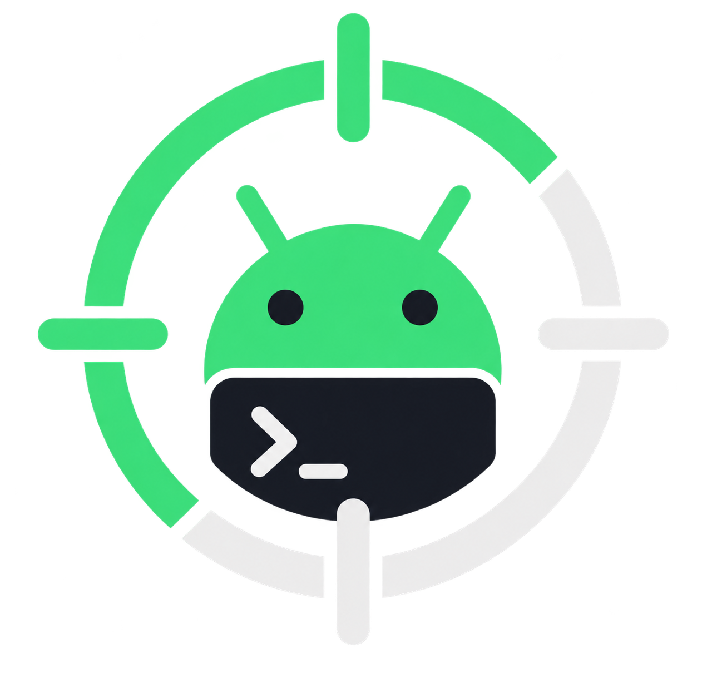

<p align="center">
  
</p>

<h1 align="center">ADBScope</h1>

<p align="center">
  Una app de escritorio nativa para Windows para debuggear y mostrar avances de apps Android directo desde tu máquina de desarrollo — información del dispositivo, espejo de pantalla en vivo con audio, una shell interactiva real y Logcat, para múltiples dispositivos, sin abrir Android Studio.
</p>

[](https://youtu.be/yHKsz_DqTTs)   

---

## Por qué existe

Trabajando en apps React Native para Android, el debugging del día a día siempre volvía a la misma fricción: las herramientas de dispositivos de Android Studio son pesadas para lo que suele ser un puñado de chequeos rápidos — ¿está online el dispositivo?, ¿cómo se ve la pantalla ahora mismo?, ¿qué hay en Logcat?, dejame meterme a una shell — y mostrar avances a alguien más desde tu propia máquina significaba o compartir pantalla con la salida cruda de `adb shell`, o levantar `scrcpy` a mano en una terminal que no tenía nada que ver con el resto del flujo de trabajo.

ADBScope es una sola herramienta para ese ciclo: conectá (por USB o WiFi) uno o varios dispositivos Android, vélos todos en una misma barra lateral, y tené un espejo de pantalla real, shell y stream de logs para el que estés trabajando en ese momento — construida como app nativa, no una pestaña de navegador, para que se sienta parte del escritorio y no un panel de devtools.

## Funcionalidades

- **Gestión de dispositivos** — detecta automáticamente dispositivos USB, WiFi (ADB por red, incluyendo emparejamiento por código en Android 11+) y emuladores; conectar/desconectar, renombrar con un alias local, y eliminar un dispositivo de la lista sin que un polling de fondo lo vuelva a traer.
- **Información del dispositivo** — modelo, fabricante, versión de Android/SDK, arquitectura de CPU y lista de ABIs, build fingerprint, resolución/densidad, batería (nivel, salud, voltaje, temperatura) y almacenamiento, con gráficos de dona para batería y almacenamiento.
- **Espejo de pantalla en vivo** — la pantalla del dispositivo embebida directamente en la ventana de la app (no un popup), con toggle de audio opcional y reconexión manual si el dispositivo se cae.
- **Captura y grabación** — screenshot y grabación de video de la pantalla del dispositivo, con carpeta de destino configurable (o elegir dónde guardar cada vez).
- **Shell interactiva** — una terminal real (no una caja de comando de una línea): colores ANSI, edición de línea, Ctrl+C, color de prompt configurable, scrollback — todo.
- **Streaming de Logcat** — tail en vivo con búsqueda, filtro por nivel (Verbose → Fatal), pausar/reanudar, orden con lo más reciente primero, y renderizado virtualizado para que una app ruidosa no trabe la UI.
- **Multi-dispositivo, un foco a la vez** — cada dispositivo conectado aparece en la barra lateral al mismo tiempo; el que selecciones obtiene la sesión de pantalla/shell/logs en vivo, y cambiar o desconectar cierra limpiamente la anterior.
- **Auto-recuperación** — si el dispositivo que estás viendo activamente se cae de USB o WiFi, sus sesiones de pantalla/shell se detienen inmediatamente y la UI muestra un estado claro de "dispositivo desconectado — reconectar" en vez de una ventana congelada.
- **UI bilingüe** — español e inglés desde el primer momento, cambiable en tiempo real, con la infraestructura de i18n lista para agregar más.
- **Tema claro / oscuro / sistema.**
- **Barra de título propia, sin marco nativo** — sin la barra de título de Windows; la app dibuja la suya.

## Cómo está construida

### Stack

| Capa | Elección | Por qué |
|---|---|---|
| Shell de escritorio | [Wails v2](https://wails.io) (Go + WebView2 nativo) | Una ventana y proceso realmente nativos, no un runtime de Chromium empaquetado como Electron — binario más chico, menos memoria, y un backend en Go que puede gestionar procesos del sistema (adb, scrcpy) de verdad en vez de invocarlos desde Node. |
| Backend | Go | Gestión de procesos (levantar/matar adb y scrcpy, canalizar su I/O) es exactamente para lo que está hecha la stdlib de Go (`os/exec`, goroutines, channels). |
| Frontend | React 19 + TypeScript + Vite | Ciclo de desarrollo rápido, y TypeScript detecta el tipo de desajuste (ID de dispositivo equivocado, forma equivocada del payload de un evento) que es fácil de meter cruzando el límite Go↔JS. |
| Estilos / componentes | Tailwind CSS v4 + shadcn/ui + Radix UI | Radix da primitivas accesibles y sin estilo (dialogs, dropdowns, tooltips) con comportamiento de teclado/foco correcto gratis; el modelo de shadcn/ui de copiar el código a tu propio repo significa que los componentes son código propio, no una dependencia caja negra; Tailwind mantiene el estilo junto al markup. |
| Estado | Zustand | El estado transversal (dispositivo seleccionado, buffer de logcat, tema, alias de dispositivos) necesita vivir fuera de cualquier árbol de componentes, sin el boilerplate de Redux para lo que termina siendo un puñado de stores chicos. |
| Gráficos | Recharts | Gráficos de dona de batería/almacenamiento en la pantalla de overview. |
| Terminal | xterm.js | Un widget de terminal real — movimiento de cursor, color ANSI, edición de línea — en vez de reimplementar un buffer de scrollback a mano. |
| Virtualización de listas | TanStack Virtual | Logcat puede producir miles de líneas por segundo; solo se renderizan las filas que están efectivamente en pantalla. |
| i18n | react-i18next | Incorporado desde el inicio en vez de agregado después — ver [Internacionalización](#internacionalización) más abajo. |
| Toasts | Sonner | |

### Arquitectura

El backend en Go sigue una separación de arquitectura limpia bastante directa, específicamente para que el frontend — y el resto del backend — nunca tengan que saber que están hablando con `adb` por debajo:

```
frontend/  (React)
   │  Bindings generados por Wails (llamadas JS tipadas hacia Go, + eventos tipados de vuelta)
   ▼
app.go  (métodos expuestos por Wails — lo único que llama el frontend)
   │
   ▼
internal/application/   ─ servicios de devices, screen, logcat, shell
   │   un Service por responsabilidad, cada uno con su propio estado de sesión
   ▼
internal/domain/        ─ Device, DeviceInfo, LogEntry, errores de dominio
   │   datos planos + una interfaz Client — sin conocimiento de ADB ni scrcpy
   ▼
internal/infrastructure/
   ├── adb/     ─ localiza y maneja el binario de adb, parsea su salida
   └── scrcpy/  ─ localiza y maneja scrcpy, embebe su ventana (solo Windows)
```

Algunas decisiones que vale la pena explicar:

- **La detección de dispositivos es push, no pull.** El backend hace polling de `adb devices` cada 1.5s, compara el resultado contra el snapshot anterior, y emite eventos granulares `device.connected` / `device.updated` / `device.disconnected`. El frontend nunca hace polling por su cuenta — solo reacciona a eventos, igual que reaccionaría a un feed de WebSocket.
- **Solo un dispositivo está "activo" a la vez.** Los servicios de screen mirroring, shell y logcat mantienen a lo sumo una sesión corriendo cada uno; arrancar una nueva detiene la que estaba corriendo antes. Se pueden *detectar* varios dispositivos simultáneamente (la barra lateral los muestra todos), pero solo se *maneja* uno a la vez — reflejar varias pantallas y shells en simultáneo quedaba fuera del alcance de cómo se usa esta herramienta en la práctica.
- **El espejo de pantalla es scrcpy, no una reimplementación.** En vez de escribir un decodificador H.264 y una capa de inyección de touch desde cero, ADBScope maneja el binario real de `scrcpy` y reparenta su ventana nativa dentro de la ventana de la app vía la API Win32 `SetParent` (`internal/infrastructure/scrcpy/window_windows.go`). El costo: es una ventana nativa de verdad, no parte del compositing de la superficie del navegador — así que siempre se renderiza por encima del contenido web sin importar el z-index de CSS (el problema del "airspace"). ADBScope resuelve ese caso puntual ocultando la ventana del espejo cada vez que se abre un dialog/dropdown/menú de Radix (detectado de forma genérica vía el atributo `data-scroll-locked` de `react-remove-scroll`) y mostrándola de nuevo cuando el overlay se cierra.
- **La shell corre a través de una pseudo-consola real, no un pipe.** La primera implementación canalizaba el stdin/stdout de `adb shell` por pipes de sistema operativo comunes, lo que reveló un bug real: el buffering propio de la salida de `adb.exe` se comporta distinto según esté conectado a una consola o no, y el síntoma era que la salida de un comando solo aparecía después de la *siguiente* tecla presionada. Cambiar a [`go-pty`](https://github.com/aymanbagabas/go-pty), que asigna una ConPTY real de Windows para el proceso hijo, lo arregló — `adb` ahora ve algo que parece una terminal de verdad, igual que si hubieras tipeado `adb shell` vos mismo.
- **adb y scrcpy viajan embebidos dentro del propio ejecutable.** La carpeta `scrcpy/` del repo (adb.exe, scrcpy.exe y sus DLLs, ~35MB) se incluye en el binario vía `//go:embed` (`main.go`) y se extrae a una carpeta de caché del usuario (`%LocalAppData%\ADBScope\scrcpy`) la primera vez que arranca la app — solo una vez, no en cada inicio, gracias a un fingerprint de los archivos embebidos (`internal/infrastructure/bundled`). El resultado: `wails build` produce un único `.exe`, sin carpeta al lado que distribuir por separado, y sin depender de que el usuario tenga el Android SDK o scrcpy instalados. Si la extracción fallara por algún motivo, `locate.go` cae de vuelta a buscar al lado del ejecutable o en el `PATH`.
- **No parpadean ventanas de consola.** Cada proceso de `adb`/`scrcpy` que se lanza se hace con `HideWindow` activado en Windows — si no, con los dispositivos sondeándose cada 1.5s, una ventana de consola aparecería y desaparecería todo el tiempo.

### Internacionalización

Los textos de la UI viven en `frontend/src/i18n/locales/{es,en}.json` con las mismas claves en ambos, cargados a través de `react-i18next`. Agregar un idioma es: sumar un archivo de locale nuevo con las mismas claves, registrarlo en `frontend/src/i18n/index.ts`, y agregarlo a `SUPPORTED_LANGUAGES` — sin tocar código en ningún otro lado. El idioma elegido (y el tema) se persisten en `localStorage` y se aplican antes del primer render para evitar un flash del valor incorrecto.

## Estructura del proyecto

```
adbscope/
├── main.go, app.go          # Punto de entrada de Wails + métodos expuestos del struct App
├── internal/
│   ├── domain/               # Device, DeviceInfo, LogEntry, errores de dominio — sin saber de ADB
│   ├── application/          # servicios de devices / screen / logcat / shell (una sesión cada uno)
│   └── infrastructure/
│       ├── adb/               # localiza y maneja adb, parsea su salida, shell vía ConPTY
│       └── scrcpy/             # localiza y maneja scrcpy, embebido de ventana Win32
├── frontend/
│   ├── src/
│   │   ├── features/           # devices / screen / shell / logcat / Settings — cada una con
│   │   │                       # components/, api.ts (llamadas tipadas a Wails), y un store.ts
│   │   ├── components/ui/      # primitivas de shadcn/ui
│   │   ├── components/layout/  # AppShell, TitleBar
│   │   └── i18n/                # locales y configuración
│   └── wailsjs/                # bindings Go↔JS autogenerados (no editar a mano)
└── scrcpy/                   # adb.exe, scrcpy.exe y sus DLLs — embebidos en el build, ver arriba
```

## Cómo empezar

**Requisitos:** Windows, [Go](https://go.dev) 1.25+, [Node.js](https://nodejs.org) 18+, y el [Wails CLI](https://wails.io/docs/gettingstarted/installation) (`go install github.com/wailsapp/wails/v2/cmd/wails@latest`).

```bash
# instala dependencias del frontend + arranca la app en modo dev (hot reload)
wails dev

# compila un binario de producción — adb/scrcpy quedan embebidos adentro
wails build
```

El resultado del build es un único archivo: `build/bin/ADBScope.exe`. No hay nada más que distribuir junto.

## Limitaciones actuales

- **El ejecutable pesa ~50MB.** La mayor parte es `SDL3.dll`, embebida junto con el resto de `scrcpy/` para que el build sea un solo archivo — ver [Arquitectura](#arquitectura).
- **Solo Windows.** El embebido de pantalla usa APIs Win32 directamente, y la shell usa ConPTY de Windows — ambas cosas específicas de la plataforma a propósito, todavía no abstraídas detrás de una interfaz para otros sistemas operativos.
- **Un solo dispositivo activo a la vez.** La detección y la barra lateral son multi-dispositivo; las sesiones en vivo de pantalla/shell/logcat no.
- **El resize de la shell remota no se propaga.** La terminal local se reacomoda, pero no se le avisa el nuevo tamaño a la PTY remota, así que apps TUI a pantalla completa (`vim`, `htop`) pueden renderizar asumiendo las dimensiones equivocadas.

## Contribuciones

Issues y PRs son bienvenidos. Para cambios grandes, abrí un issue primero para discutir el enfoque antes de meterte a escribir código.

## Licencia

[MIT](LICENSE) — © 2026 ToledoFernando.

### Licencias de terceros

El binario embebe herramientas de terceros (`scrcpy/`, ver [Arquitectura](#arquitectura)), cada una bajo su propia licencia:

- **[scrcpy](https://github.com/Genymobile/scrcpy)** — Apache License 2.0.
- **adb** (Android Debug Bridge, parte del Android Open Source Project) — Apache License 2.0.
- **[SDL3](https://www.libsdl.org/)** — Zlib License.
- **FFmpeg** (`avcodec`/`avformat`/`avutil`/`swresample`) — LGPL. scrcpy distribuye builds de FFmpeg sin componentes GPL específicamente para poder redistribuirse bajo Apache 2.0; si reemplazás estos binarios por otro build de FFmpeg, verificá su licencia antes de redistribuir.

Ninguna de estas licencias impone copyleft sobre este repositorio, pero si redistribuís el `.exe` compilado seguís obligado a cumplir sus términos (incluir avisos de copyright, etc.) — no vienen los archivos de licencia de terceros embebidos en `scrcpy/` todavía; agregalos ahí si vas a distribuir binarios públicamente.
